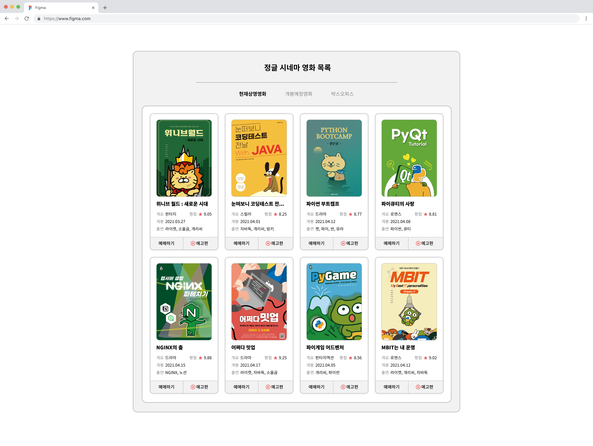

# Project 01: Jungle Cinema - 최신 영화 프리뷰 페이지

## 소개
이 프로젝트는 HTML, CSS를 활용하여 최신 영화 정보를 프리뷰 형식으로 보여주는 웹 페이지입니다. 강의를 통해 학습한 내용을 바탕으로 실제 영화 목록 페이지를 구현했습니다.

## 주요 기능
- 영화 목록을 카드 형식으로 표시
- 각 영화에 대한 기본 정보(장르, 평점, 개봉일, 출연진) 제공
- "예매하기", "예고편", "영화 상세 정보"(영화 이미지) 링크 제공
- 영화 제목이 길 경우, 한 줄 또는 두 줄 말줄임 표시 적용

## 기술 스택
- **HTML5**: 시맨틱 태그를 사용하여 구조화된 마크업
- **CSS3**: 클래식을 이용한 레이아웃 구현, 유틸리티 클래스(`sr-only`, `ellipsis`)를 활용한 스타일링

## 상세 설명

### 1. 스킵 네비게이션
- **사용 이유**: 웹 접근성을 고려하여 키보드 사용자들이 콘텐츠로 빠르게 이동할 수 있도록 지원.
- **구현 방식**: 탭 키를 사용하면 화면에 나타나고, 포커스가 벗어나면 다시 숨겨지도록 구성.

### 2. 영화 목록
- 각 영화는 `<article>` 태그로 구성되어 있으며, 독립적인 정보 레이아웃으로 관리됩니다.
- 영화 정보는 `<dl>` 태그를 사용해 시맨틱하게 구성되었으며, 영화 제목, 평점, 개봉일, 출연진 정보를 제공합니다.

### 3. 유틸리티 클래스
- **`sr-only`**: 스크린 리더 전용 텍스트를 위한 클래스. 시각적으로는 숨겨지지만, 접근성을 위해 음성으로 읽힙니다.
- **`sl-ellipsis`**: 텍스트가 길 경우 한 줄 말줄임 효과를 제공합니다.
- **`multi-ellipsis`**: 두 줄 말줄임을 위한 유틸리티로, `-webkit-line-clamp`을 활용해 텍스트를 잘라냅니다.

### 4. 레이아웃 및 스타일링
- CSS의 `float`를 사용하여 영화 카드 레이아웃을 구성하였습니다.
- 카드 형식의 영화 정보를 표시하기 위해 `border-radius`, `box-shadow` 등의 스타일을 활용했습니다.
- 배경 이미지와 텍스트가 깔끔하게 조화되도록 다양한 CSS 기법을 적용했습니다.

## 학습 포인트
- HTML5의 시맨틱 마크업을 활용한 구조화된 페이지 구성
- CSS의 클래식을 이용한 레이아웃 및 스타일링 구현
- 웹 접근성을 고려한 마크업 및 디자인 요소 적용
