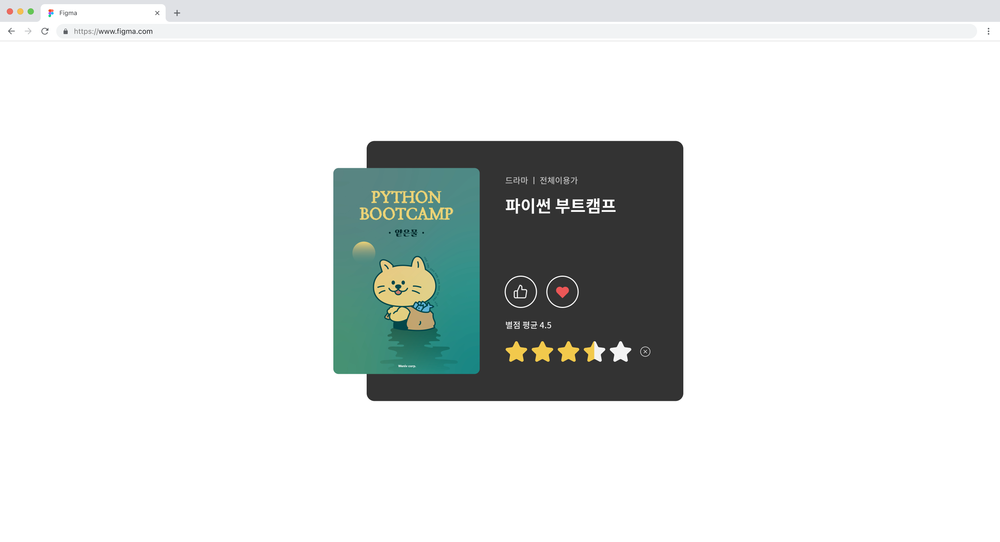

# Project 03: 영화 별점 평가 웹 애플리케이션

## 소개
사용자가 영화를 평가하고, 별점을 매길 수 있는 인터랙티브한 웹 페이지입니다. HTML, CSS, JavaScript를 사용해 개발되었으며, 사용자는 버튼 클릭을 통해 영화를 찜하거나 추천할 수 있고, 별점을 매기고 초기화할 수 있습니다. 별점은 마우스의 위치에 따라 반응하며, 별점이 고정된 후에는 사용자가 다른 별점을 선택할 수 없습니다.

## 주요 기능
- 별점 매기기: 사용자가 마우스를 움직여 별점을 매기고, 클릭하면 별점이 고정됩니다.
- 별점 초기화: 별점이 고정된 후, 초기화 버튼을 눌러 다시 별점을 선택할 수 있습니다.
- 추천/찜하기 버튼: 버튼 클릭을 통해 사용자가 영화를 추천하거나 찜할 수 있습니다.

## 기술 스택
- **HTML5**: 페이지 구조 정의
- **CSS3**: 레이아웃 및 스타일링,
- **JavaScript (ES6)**: 별점 기능, 버튼 기능 등의 동작을 구현

## 상세 설명

### 1. 클래스 구조 사용
- **Favorite 클래스:**
  - 사용자가 영화에 대해 추천하거나 찜하기 버튼을 클릭할 때, 버튼에 on 클래스를 추가하여 상태를 변경하는 기능을 담당합니다.
- **StarPoint 클래스:**
  - 영화 별점 기능을 담당합니다. 사용자가 마우스를 움직여 별점을 매기고, 클릭하면 별점이 고정됩니다. 고정된 별점은 초기화 버튼을 눌러 다시 설정할 수 있습니다.

### 2. 이벤트 처리
**Favorite 클래스:**
  - `bindEvents` 메서드: `.content-favorite` 요소에서 클릭 이벤트를 감지하여 버튼의 상태를 변경합니다. 버튼이 클릭될 때마다 `on` 클래스가 토글되어 버튼의 상태가 시각적으로 반영됩니다.

**StarPoint 클래스:**
  - `bindEvents` 메서드:
    - 별점 매기기: 마우스가 별점 이미지 위를 이동할 때, 마우스 위치에 따라 별점이 실시간으로 반영됩니다.
    - 별점 고정: 사용자가 별점을 클릭하면, 해당 별점이 고정됩니다.
    - 별점 초기화: 사용자가 초기화 버튼을 누르면, 고정된 별점이 초기화됩니다.
  - `renderStarPointImages` 메서드:
    - 사용자의 마우스 위치에 따라 별점 이미지를 동적으로 변경합니다. 별점이 고정되거나 초기화될 때마다 이미지를 다시 그려줍니다.

### 3. 상태 관리
**별점 고정 관리:**
  - `StarPoint` 클래스는 `lockedStarPoint` 변수를 사용해 별점이 고정되었는지 여부를 관리합니다. 별점이 고정되면 사용자의 마우스 이동에 반응하지 않도록 설정됩니다.

## 학습 포인트
- **객체 지향 프로그래밍(OOP):** JavaScript 클래스와 메서드를 활용해 기능을 모듈화하고, 코드의 재사용성을 높이는 방법을 학습.
- **이벤트 바인딩:** JavaScript를 사용해 DOM 요소에 이벤트 리스너를 추가하고, 사용자의 상호작용에 따라 UI를 동적으로 변경하는 방법을 익힘.
- **상태 관리:** 애플리케이션 상태(예: 별점의 고정 상태)를 관리하고, 그에 따라 UI의 동작을 제어하는 방법을 배움.
