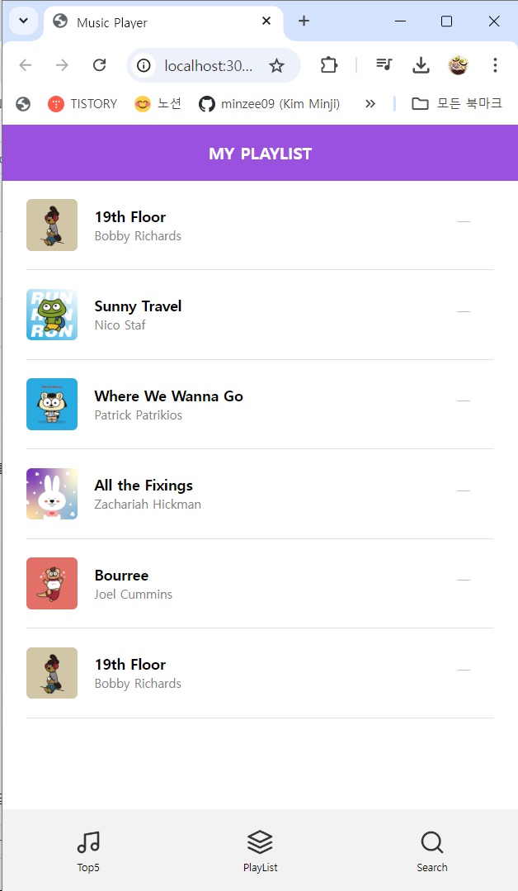

# Project 04: 뮤직 플레이어

## 소개
사용자는 음악을 재생, 일시 정지, 탐색할 수 있으며, 음악 리스트를 관리하고 검색할 수 있습니다. 이 애플리케이션은 탭 기반의 UI를 통해 Top5 음악, 재생 목록, 검색 기능을 제공합니다.

## 주요 기능
- **음악 재생 및 일시 정지:** 선택한 음악을 재생하거나 일시 정지할 수 있습니다.
- **플레이리스트 관리:** 사용자는 재생 목록에 음악을 추가하거나 제거할 수 있습니다.
- **음악 검색:** 사용자가 입력한 키워드로 음악을 검색하고 결과를 보여줍니다.
- **탭 전환:** Top5, 플레이리스트, 검색 기능을 제공하는 탭 전환 기능.

## 기술 스택
- **HTML5**: 페이지 구조 정의
- **CSS3**: Flexbox 및 Grid 레이아웃을 활용하여 반응형 디자인을 구현
- **JavaScript (ES6)**: 이벤트 기반의 사용자 인터페이스를 구현
- *로컬 스토리지(Local Storage)*: 사용자 재생 목록을 저장하여 페이지 새로 고침 시에도 유지되도록 구현

## 페이지별 기능 설명

### 1. `App.js`
- **역할**: 애플리케이션의 메인 로직을 관리 + 각 컴포넌트를 초기화하고 이벤트를 처리
- **주요 메서드:**
  - `setup()`: 애플리케이션을 초기화하는 비동기 메서드로, 음악 데이터를 가져오고, 초기 컴포넌트를 설정합니다. App 클래스의 중심적인 초기화 과정이며, 각 컴포넌트를 생성하고 필요한 이벤트를 바인딩합니다.
  - `bindEvents()`: 각 컴포넌트에서 발생하는 다양한 이벤트를 처리하는 메서드입니다. 예를 들어, 탭 버튼 클릭 시 화면을 전환하거나, 음악 재생 요청이 있을 때 해당 음악을 PlayView로 전달하는 등의 작업을 처리합니다.
  - `render()`: 현재 활성화된 탭에 따라 적절한 컴포넌트를 렌더링합니다. 탭 버튼과 메인 뷰를 초기화하고, 선택된 탭에 해당하는 내용을 화면에 표시합니다.
 
### 2. `Intro.js`
- **역할**: 초기 로고 또는 인트로 화면을 보여주는 역할
- **주요 메서드:**
  - `show()`: 인트로 화면을 표시하는 메서드로, 페이지 로드 시 인트로 화면을 보여줍니다.
  - `hide()`: 인트로 화면을 숨기는 메서드로, 메인 애플리케이션이 로드되면 인트로 화면을 부드럽게 제거합니다.

### 3. `TabButtons.js`
- **역할**: 상단 탭 버튼을 렌더링하고, 사용자 입력에 따라 탭을 전환
- **주요 메서드:**
  - `createRenderElement()`: 탭 버튼을 생성하고, 각 버튼에 해당하는 아이콘과 제목을 설정합니다. 이 메서드는 탭 버튼의 구조를 정의하며, `ul` 요소 내에 각 탭을 리스트 형태로 추가합니다.

### 4. `TopMusic.js`
- **역할**: 상위 5개의 음악 리스트를 보여주고, 음악 재생, 일시 정지, 플레이리스트 추가 기능을 제공
- **주요 메서드:**
  - `setMusic(music)`: 서버에서 가져온 음악 데이터를 설정하고, 이를 기반으로 화면에 리스트를 표시합니다.
  - `requestPlay(target)`: 재생 버튼이 클릭되면 해당 음악을 재생하고, 다른 재생 중인 음악이 있으면 이를 중단하는 작업을 처리합니다.
  - `requestPause(target)`: 현재 재생 중인 음악을 일시정지합니다.
  - `requestAddPlayList(target)`: 선택된 음악을 플레이리스트에 추가하는 기능을 제공합니다.

### 5. `SearchView.js`
- **역할**: 사용자가 음악을 검색할 수 있는 인터페이스를 제공
- **주요 메서드:**
  - `setSearchResult(musicList)`: 사용자가 입력한 검색어에 맞는 음악 목록을 설정하고, 이를 화면에 표시합니다.
  - `requestPlay(target)`: 검색 결과에서 선택된 음악을 재생합니다.
  - `requestPause(target)`: 검색 결과에서 재생 중인 음악을 일시정지합니다.
  - `requestAddPlayList(target)`: 검색 결과에서 선택된 음악을 플레이리스트에 추가합니다.

### 6. `PlayView.js`
- **역할**: 선택된 음악의 세부 정보를 표시하고, 재생, 일시 정지, 다음/이전 곡 이동 등을 제어
- **주요 메서드:**
  - `playMusic(payload)`: 재생 요청이 들어온 음악을 재생하며, 현재 재생 중인 음악 정보를 화면에 업데이트합니다.
  - `pause()`: 현재 재생 중인 음악을 일시정지합니다.
  - `renderMusicContainer()`: 재생 중인 음악의 정보를 화면에 표시하고, 음악 컨트롤 버튼(재생, 일시정지, 다음, 이전 등)을 렌더링합니다.

### 6. `PlayList.js`
- **역할**: 사용자가 관리할 수 있는 음악 재생 목록을 표시
- **주요 메서드:**
  - `add(music)`: 현재 재생 목록에 새로운 음악을 추가하고, 로컬 스토리지에 저장합니다.
  - `remove(index)`: 재생 목록에서 지정된 인덱스의 음악을 제거하고, 로컬 스토리지에 저장합니다.
  - `playMusicItem(target)`: 재생 목록에서 선택된 음악을 재생하고, 선택된 상태로 표시합니다.

## 학습 포인트
- **JavaScript 이벤트 처리**: 각 컴포넌트 간의 이벤트를 처리하고 통신하는 방법을 배웁니다.
- **동적 DOM 조작**: JavaScript를 활용하여 DOM을 동적으로 조작하고, 사용자 상호작용에 반응하는 UI를 구현합니다.
- **로컬 스토리지 사용**: 재생 목록을 로컬 스토리지에 저장하고 불러오는 방법을 학습합니다.
